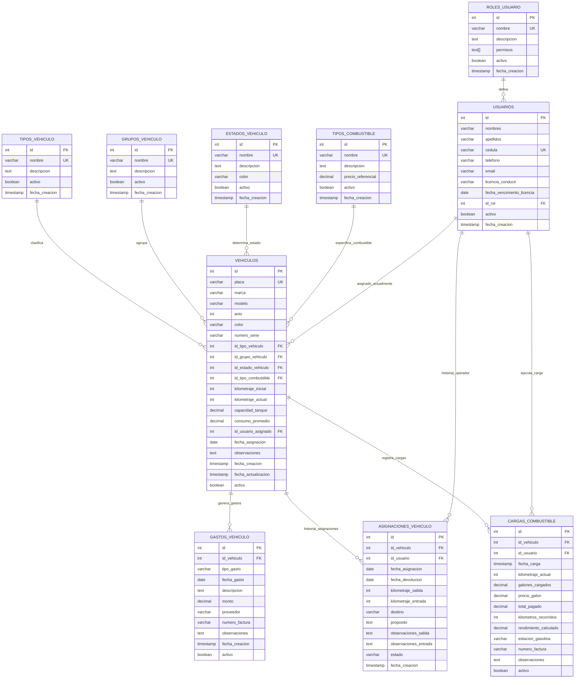

```mermaid
erDiagram
    %% ====================================================================
    %% DIAGRAMA ER - GESTOR DE FLOTA DE VEHÍCULOS
    %% ====================================================================
    
    %% Tablas de Catálogos (Maestros)
    TIPOS_VEHICULO {
        int id PK
        varchar nombre UK
        text descripcion
        boolean activo
        timestamp fecha_creacion
    }
    
    GRUPOS_VEHICULO {
        int id PK
        varchar nombre UK
        text descripcion
        boolean activo
        timestamp fecha_creacion
    }
    
    ESTADOS_VEHICULO {
        int id PK
        varchar nombre UK
        text descripcion
        varchar color
        boolean activo
        timestamp fecha_creacion
    }
    
    TIPOS_COMBUSTIBLE {
        int id PK
        varchar nombre UK
        text descripcion
        decimal precio_referencial
        boolean activo
        timestamp fecha_creacion
    }
    
    ROLES_USUARIO {
        int id PK
        varchar nombre UK
        text descripcion
        text[] permisos
        boolean activo
        timestamp fecha_creacion
    }
    
    %% Tabla de Usuarios/Empleados
    USUARIOS {
        int id PK
        varchar nombres
        varchar apellidos
        varchar cedula UK
        varchar telefono
        varchar email
        varchar licencia_conducir
        date fecha_vencimiento_licencia
        int id_rol FK
        boolean activo
        timestamp fecha_creacion
    }
    
    %% Tabla Principal - Vehículos
    VEHICULOS {
        int id PK
        varchar placa UK
        varchar marca
        varchar modelo
        int anio
        varchar color
        varchar numero_serie
        int id_tipo_vehiculo FK
        int id_grupo_vehiculo FK
        int id_estado_vehiculo FK
        int id_tipo_combustible FK
        int kilometraje_inicial
        int kilometraje_actual
        decimal capacidad_tanque
        decimal consumo_promedio
        int id_usuario_asignado FK
        date fecha_asignacion
        text observaciones
        timestamp fecha_creacion
        timestamp fecha_actualizacion
        boolean activo
    }
    
    %% Tabla de Cargas de Combustible
    CARGAS_COMBUSTIBLE {
        int id PK
        int id_vehiculo FK
        int id_usuario FK
        timestamp fecha_carga
        int kilometraje_actual
        decimal galones_cargados
        decimal precio_galon
        decimal total_pagado
        int kilometros_recorridos
        decimal rendimiento_calculado
        varchar estacion_gasolina
        varchar numero_factura
        text observaciones
        boolean activo
    }
    
    %% Tabla de Asignaciones (Historial)
    ASIGNACIONES_VEHICULO {
        int id PK
        int id_vehiculo FK
        int id_usuario FK
        date fecha_asignacion
        date fecha_devolucion
        int kilometraje_salida
        int kilometraje_entrada
        varchar destino
        text proposito
        text observaciones_salida
        text observaciones_entrada
        varchar estado
        timestamp fecha_creacion
    }
    
    %% Tabla de Gastos Adicionales
    GASTOS_VEHICULO {
        int id PK
        int id_vehiculo FK
        varchar tipo_gasto
        date fecha_gasto
        text descripcion
        decimal monto
        varchar proveedor
        varchar numero_factura
        text observaciones
        timestamp fecha_creacion
        boolean activo
    }
    
    %% ====================================================================
    %% RELACIONES
    %% ====================================================================
    
    %% Relaciones de USUARIOS
    ROLES_USUARIO ||--o{ USUARIOS : "define"
    
    %% Relaciones de VEHICULOS (con catálogos)
    TIPOS_VEHICULO ||--o{ VEHICULOS : "clasifica"
    GRUPOS_VEHICULO ||--o{ VEHICULOS : "agrupa"
    ESTADOS_VEHICULO ||--o{ VEHICULOS : "determina_estado"
    TIPOS_COMBUSTIBLE ||--o{ VEHICULOS : "especifica_combustible"
    
    %% Relación de Asignación Actual
    USUARIOS ||--o{ VEHICULOS : "asignado_actualmente"
    
    %% Relaciones de CARGAS_COMBUSTIBLE
    VEHICULOS ||--o{ CARGAS_COMBUSTIBLE : "registra_cargas"
    USUARIOS ||--o{ CARGAS_COMBUSTIBLE : "ejecuta_carga"
    
    %% Relaciones de ASIGNACIONES_VEHICULO (Historial)
    VEHICULOS ||--o{ ASIGNACIONES_VEHICULO : "historial_asignaciones"
    USUARIOS ||--o{ ASIGNACIONES_VEHICULO : "historial_operador"
    
    %% Relaciones de GASTOS_VEHICULO
    VEHICULOS ||--o{ GASTOS_VEHICULO : "genera_gastos"
```
