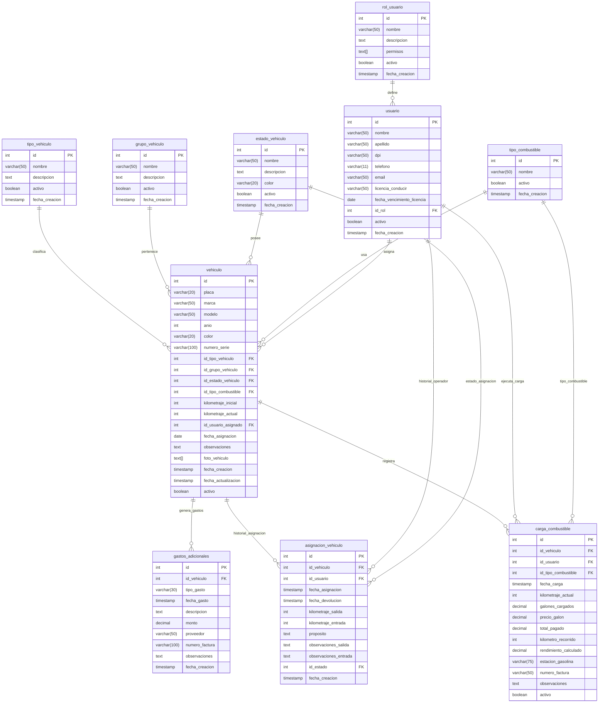

```mermaid
erDiagram
    %% ====================================================================
    %% DIAGRAMA ER - GESTOR DE FLOTA DE VEHÍCULOS
    %% Versión Personalizada del Usuario
    %% ====================================================================
    
    %% Tablas de Catálogos (Maestros)
    tipo_vehiculo {
        int id PK
        varchar(50) nombre
        text descripcion
        boolean activo
        timestamp fecha_creacion
    }
    
    grupo_vehiculo {
        int id PK
        varchar(50) nombre
        text descripcion
        boolean activo
        timestamp fecha_creacion
    }
    
    estado_vehiculo {
        int id PK
        varchar(50) nombre
        text descripcion
        varchar(20) color
        boolean activo
        timestamp fecha_creacion
    }
    
    tipo_combustible {
        int id PK
        varchar(50) nombre
        boolean activo
        timestamp fecha_creacion
    }
    
    rol_usuario {
        int id PK
        varchar(50) nombre
        text descripcion
        text[] permisos
        boolean activo
        timestamp fecha_creacion
    }
    
    %% Tabla de Usuarios/Empleados
    usuario {
        int id PK
        varchar(50) nombre
        varchar(50) apellido
        varchar(50) dpi
        varchar(11) telefono
        varchar(50) email
        varchar(50) licencia_conducir
        date fecha_vencimiento_licencia
        int id_rol FK
        boolean activo
        timestamp fecha_creacion
    }
    
    %% Tabla Principal - Vehículos
    vehiculo {
        int id PK
        varchar(20) placa
        varchar(50) marca
        varchar(50) modelo
        int anio
        varchar(20) color
        varchar(100) numero_serie
        int id_tipo_vehiculo FK
        int id_grupo_vehiculo FK
        int id_estado_vehiculo FK
        int id_tipo_combustible FK
        int kilometraje_inicial
        int kilometraje_actual
        int id_usuario_asignado FK
        date fecha_asignacion
        text observaciones
        text[] foto_vehiculo
        timestamp fecha_creacion
        timestamp fecha_actualizacion
        boolean activo
    }
    
    %% Tabla de Cargas de Combustible
    carga_combustible {
        int id PK
        int id_vehiculo FK
        int id_usuario FK
        int id_tipo_combustible FK
        timestamp fecha_carga
        int kilometraje_actual
        decimal galones_cargados
        decimal precio_galon
        decimal total_pagado
        int kilometro_recorrido
        decimal rendimiento_calculado
        varchar(75) estacion_gasolina
        varchar(50) numero_factura
        text observaciones
        boolean activo
    }
    
    %% Tabla de Asignaciones (Historial)
    asignacion_vehiculo {
        int id PK
        int id_vehiculo FK
        int id_usuario FK
        timestamp fecha_asignacion
        timestamp fecha_devolucion
        int kilometraje_salida
        int kilometraje_entrada
        text proposito
        text observaciones_salida
        text observaciones_entrada
        int id_estado FK
        timestamp fecha_creacion
    }
    
    %% Tabla de Gastos Adicionales
    gastos_adicionales {
        int id PK
        int id_vehiculo FK
        varchar(30) tipo_gasto
        timestamp fecha_gasto
        text descripcion
        decimal monto
        varchar(50) proveedor
        varchar(100) numero_factura
        text observaciones
        timestamp fecha_creacion
    }
    
    %% ====================================================================
    %% RELACIONES
    %% ====================================================================
    
    %% Relaciones de USUARIOS
    rol_usuario ||--o{ usuario : "define"
    
    %% Relaciones de VEHICULOS (con catálogos)
    tipo_vehiculo ||--o{ vehiculo : "clasifica"
    grupo_vehiculo ||--o{ vehiculo : "pertenece"
    estado_vehiculo ||--o{ vehiculo : "posee"
    tipo_combustible ||--o{ vehiculo : "usa"
    
    %% Relación de Asignación Actual
    usuario ||--o{ vehiculo : "asigna"
    
    %% Relaciones de CARGAS_COMBUSTIBLE
    vehiculo ||--o{ carga_combustible : "registra"
    usuario ||--o{ carga_combustible : "ejecuta_carga"
    tipo_combustible ||--o{ carga_combustible : "tipo_combustible"
    
    %% Relaciones de ASIGNACIONES_VEHICULO (Historial)
    vehiculo ||--o{ asignacion_vehiculo : "historial_asignacion"
    usuario ||--o{ asignacion_vehiculo : "historial_operador"
    estado_vehiculo ||--o{ asignacion_vehiculo : "estado_asignacion"
    
    %% Relaciones de GASTOS_VEHICULO
    vehiculo ||--o{ gastos_adicionales : "genera_gastos"
```
