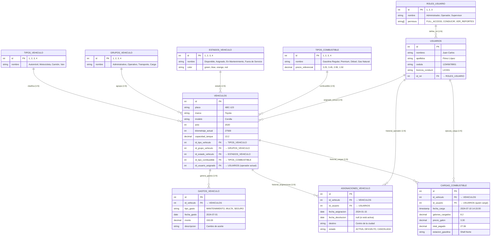

```mermaid
erDiagram
    %% ====================================================================
    %% DIAGRAMA ER SIMPLIFICADO - GESTOR DE FLOTA
    %% ====================================================================
    
    %% CATÁLOGOS BÁSICOS
    TIPOS_VEHICULO {
        int id PK "1, 2, 3, 4"
        string nombre "Automóvil, Motocicleta, Camión, Van"
    }
    
    GRUPOS_VEHICULO {
        int id PK "1, 2, 3, 4"
        string nombre "Administrativo, Operativo, Transporte, Carga"
    }
    
    ESTADOS_VEHICULO {
        int id PK "1, 2, 3, 4"
        string nombre "Disponible, Asignado, En Mantenimiento, Fuera de Servicio"
        string color "green, blue, orange, red"
    }
    
    TIPOS_COMBUSTIBLE {
        int id PK "1, 2, 3, 4"
        string nombre "Gasolina Regular, Premium, Diésel, Gas Natural"
        decimal precio_referencial "3.25, 3.45, 2.95, 1.50"
    }
    
    %% ROLES Y USUARIOS
    ROLES_USUARIO {
        int id PK "1, 2, 3"
        string nombre "Administrador, Operador, Supervisor"
        string[] permisos "FULL_ACCESS, CONDUCIR, VER_REPORTES"
    }
    
    USUARIOS {
        int id PK
        string nombres "Juan Carlos"
        string apellidos "Pérez López"
        string cedula "12345678901"
        string licencia_conducir "LIC001"
        int id_rol FK "→ ROLES_USUARIO"
    }
    
    %% TABLA CENTRAL
    VEHICULOS {
        int id PK
        string placa "ABC-123"
        string marca "Toyota"
        string modelo "Corolla"
        int anio "2020"
        int kilometraje_actual "27500"
        decimal capacidad_tanque "13.2"
        int id_tipo_vehiculo FK "→ TIPOS_VEHICULO"
        int id_grupo_vehiculo FK "→ GRUPOS_VEHICULO"
        int id_estado_vehiculo FK "→ ESTADOS_VEHICULO"
        int id_tipo_combustible FK "→ TIPOS_COMBUSTIBLE"
        int id_usuario_asignado FK "→ USUARIOS (operador actual)"
    }
    
    %% OPERACIONES
    CARGAS_COMBUSTIBLE {
        int id PK
        int id_vehiculo FK "→ VEHICULOS"
        int id_usuario FK "→ USUARIOS (quien cargó)"
        timestamp fecha_carga "2024-07-10 14:15:00"
        decimal galones_cargados "8.2"
        decimal precio_galon "3.30"
        decimal total_pagado "27.06"
        string estacion_gasolina "Shell Norte"
    }
    
    ASIGNACIONES_VEHICULO {
        int id PK
        int id_vehiculo FK "→ VEHICULOS"
        int id_usuario FK "→ USUARIOS"
        date fecha_asignacion "2024-01-15"
        date fecha_devolucion "null (si está activa)"
        string destino "Centro de la ciudad"
        string estado "ACTIVA, DEVUELTO, CANCELADA"
    }
    
    GASTOS_VEHICULO {
        int id PK
        int id_vehiculo FK "→ VEHICULOS"
        string tipo_gasto "MANTENIMIENTO, MULTA, SEGURO"
        date fecha_gasto "2024-07-01"
        decimal monto "150.00"
        string descripcion "Cambio de aceite"
    }
    
    %% ====================================================================
    %% RELACIONES PRINCIPALES
    %% ====================================================================
    
    %% Catálogos → Vehículos
    TIPOS_VEHICULO ||--o{ VEHICULOS : "clasifica (1:N)"
    GRUPOS_VEHICULO ||--o{ VEHICULOS : "agrupa (1:N)"
    ESTADOS_VEHICULO ||--o{ VEHICULOS : "estado (1:N)"
    TIPOS_COMBUSTIBLE ||--o{ VEHICULOS : "combustible (1:N)"
    
    %% Usuarios y Roles
    ROLES_USUARIO ||--o{ USUARIOS : "define_rol (1:N)"
    USUARIOS ||--o{ VEHICULOS : "asignado_actual (1:N)"
    
    %% Operaciones
    VEHICULOS ||--o{ CARGAS_COMBUSTIBLE : "historial_cargas (1:N)"
    USUARIOS ||--o{ CARGAS_COMBUSTIBLE : "ejecuta_carga (1:N)"
    
    VEHICULOS ||--o{ ASIGNACIONES_VEHICULO : "historial_asignaciones (1:N)"
    USUARIOS ||--o{ ASIGNACIONES_VEHICULO : "historial_operador (1:N)"
    
    VEHICULOS ||--o{ GASTOS_VEHICULO : "genera_gastos (1:N)"
```
